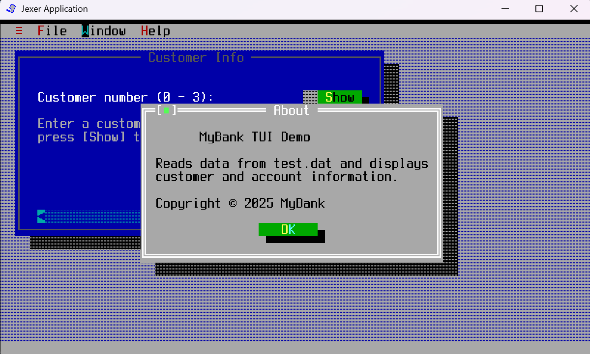
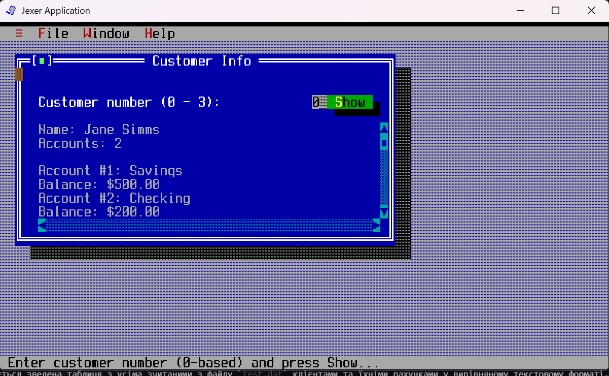
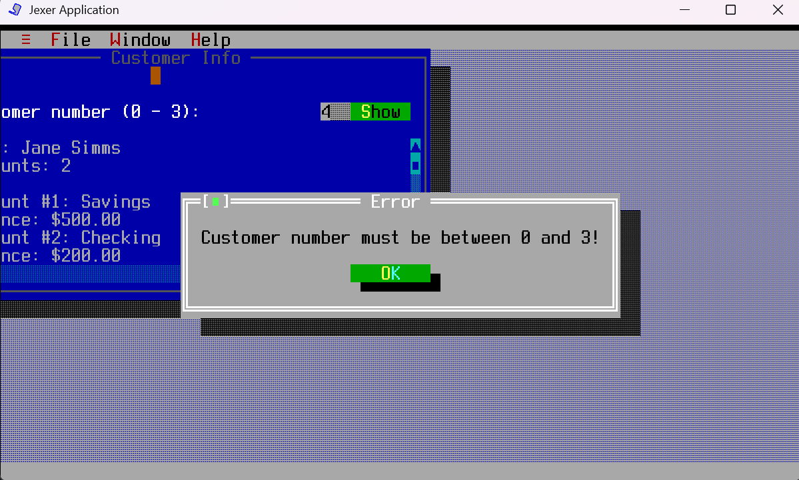

### 1. Мета роботи
Ознайомитися з принципами побудови текстового інтерфейсу користувача (TUI) в Java за допомогою сторонніх бібліотек. Навчитися інтегрувати розроблену раніше об'єктну модель банку (`Bank`, `Customer`, `Account`) та механізм завантаження даних із бінарного/текстового файлу (`test.dat`) у віконний інтерфейс Jexer.

---

### 2. Завдання на "5" балів та хід виконання
1. Підключено бібліотеку `Jexer` (модуль `jexer.jar`) через налаштування проєкту (`Properties` -> `Libraries` -> `Add JAR/Folder`).
2. Створено клас `TUIdemo.java`, який наслідує `jexer.TApplication` та ініціалізує інтерфейс у режимі `BackendType.SWING`.
3. Реалізовано автоматичне завантаження даних про клієнтів із файлу `data/test.dat` за допомогою класу `DataSource` під час старту програми.
4. Повністю переписано метод `showCustomerDetails()`. Тепер він динамічно визначає кількість зчитаних клієнтів, приймає індекс користувача, перевіряє коректність введення та виводить текстову інформацію про клієнта разом із деталями його рахунків (`SavingsAccount`, `CheckingAccount`).
5. **Додатково:** Реалізовано метод `showCustomerReport()` для генерації загального звіту по всій базі даних банку в окремому текстовому вікні.

---

### 3. Демонстрація роботи програми (Скріншоти)

#### А. Головне вікно програми та меню Help
При запуску програми відкривається графічне вікно TUI. У меню *Help -> About* відображається інформація про додаток.

> 

---

#### Б. Вікно інформації про клієнта (Customer Info)
Вікно відображає підказку з діапазоном доступних індексів, який вираховується автоматично на основі файлу `test.dat`. Після введення номера клієнта та натискання кнопки **Show** виводяться його ім'я, прізвище, кількість рахунків та баланс кожного з них.

> 

---

#### В. Обробка помилок введення (Валідація даних)
Якщо користувач вводить номер клієнта, який виходить за межі існуючих індексів файлу `test.dat`, або вводить некоректні символи (літери), програма перехоплює виняток і виводить `messageBox` із помилкою.

> 

---

#### Г. Додатковий функціонал: Загальний звіт (Customer Report)
При обранні пункту меню *File -> Customer Report* генерується зведена таблиця з усіма зчитаними з файлу `test.dat` клієнтами та їхніми рахунками у вирівняному текстовому форматі.

> )
